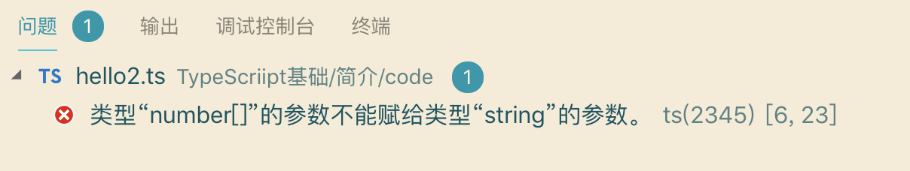

## **Hello TypeScript**

我们从一个简单的例子开始

将要下代码复现到hello.ts文件中

```
function sayHello(person: string){
  return 'Hello, ' + person
}

let user = 'Tom'
console.log(sayHello(user))
```

然后执行

```
tsc hello.ts
```

这时会生成一个编译好的文件 hello.js

```
function sayHello(person) {
    return 'Hello, ' + person;
}
var user = 'Tom';
console.log(sayHello(user));
```

TypeScript中,使用 `:` 指定`person`参数的类型为`string`.但编译为为js后,并没有什么检查的代码被插入进来.

> TypeScript只会进行静态检查,如果发现有错误,编译时就会报错.

>let 是 ES6 中的关键字,和 var 类似,用于定义一个局部变量.

下面尝试把这段代码编译一下:

```
function sayHello(person:tring){
  return 'Hello, ' + person
}

let user = [0,1,2]
console.log(sayHello(user))
```

在编辑的时候会提示

```
hello2.ts:6:23 - error TS2345: Argument of type 'number[]' is not assignable to parameter of type 'string'.

6 console.log(sayHello2(user2))
```

同时在编辑中也会提示(此处为vscode编辑器)


但还是产生了js文件

```
function sayHello2(person) {
    return 'Hello, ' + person;
}
var user2 = [0, 1, 2];
console.log(sayHello2(user2));
```

> TypeScript编译的时候即使报错了,还是会生成编译结果,我们仍然可以使用这个编译之后的文件

如要在报错的时候终止js文件的生成,可以在 tsconfig.json 中配置 noEmitiOnError 即可,关于tsconfig.json,请参阅[官方手册(中文版)](https://zhongsp.gitbooks.io/typescript-handbook/content/doc/handbook/tsconfig.json.html)